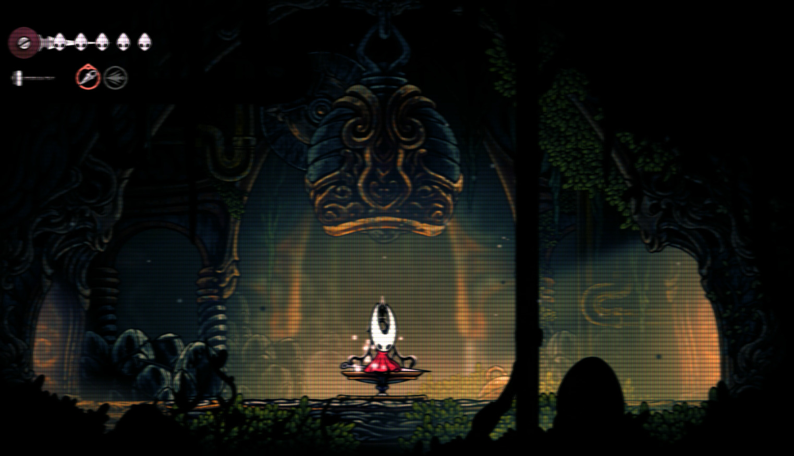

# GoverlayFilters
Some custom filters to use in Goverlay on Linux.

Tested only on CachyOs with a SEMP TOSHIBA LED 32 POL. (MOD: TV LED V2 32L2400) Television as a monitor (some parameters may need to be changed to work on other screens)

## 1. Install Goverlay
```bash
sudo pacman -S goverlay
```

2. Setup Shaders Directory
3. 
Navigate to the vkBasalt shaders folder (create it if it doesn't exist):

```bash
mkdir -p ~/.local/share/vkBasalt/shaders
cd ~/.local/share/vkBasalt/shaders
```

## 3. Download Dependencies

Run the following command to download the essential ReShade.fxh header:

```bash
curl -L -o ReShade.fxh https://raw.githubusercontent.com/crosire/reshade-shaders/master/Shaders/ReShade.fxh
```

## 4. Install Filters

Add the .fx files from this repository to the same folder: ~/.local/share/vkBasalt/shaders

## 5. Activation

Open GOverlay.

Go to the vkBasalt tab.

Enable your desired filter and test it using VKCube.

## Shader Demos:

### CRT Light


### CRT Heavy

